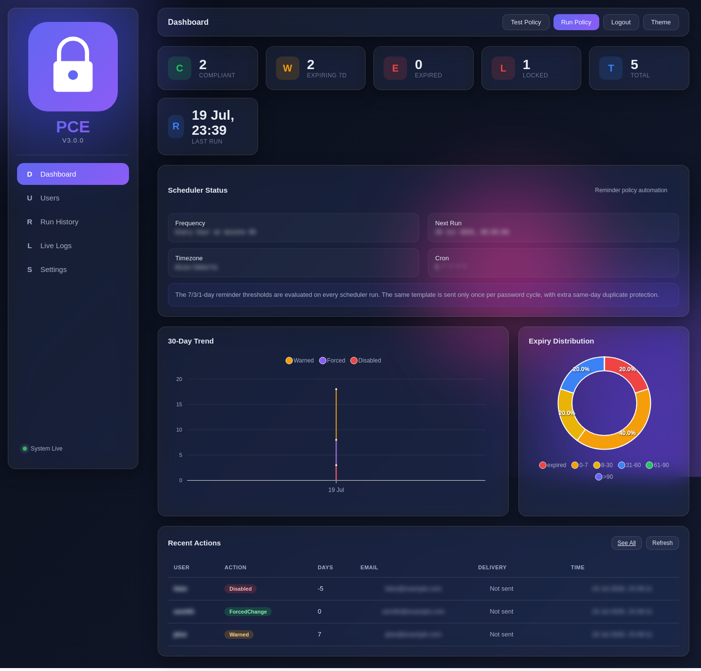
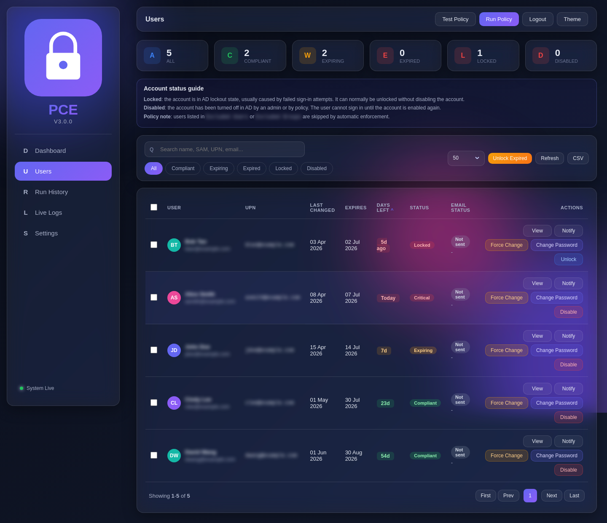
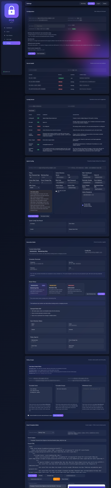
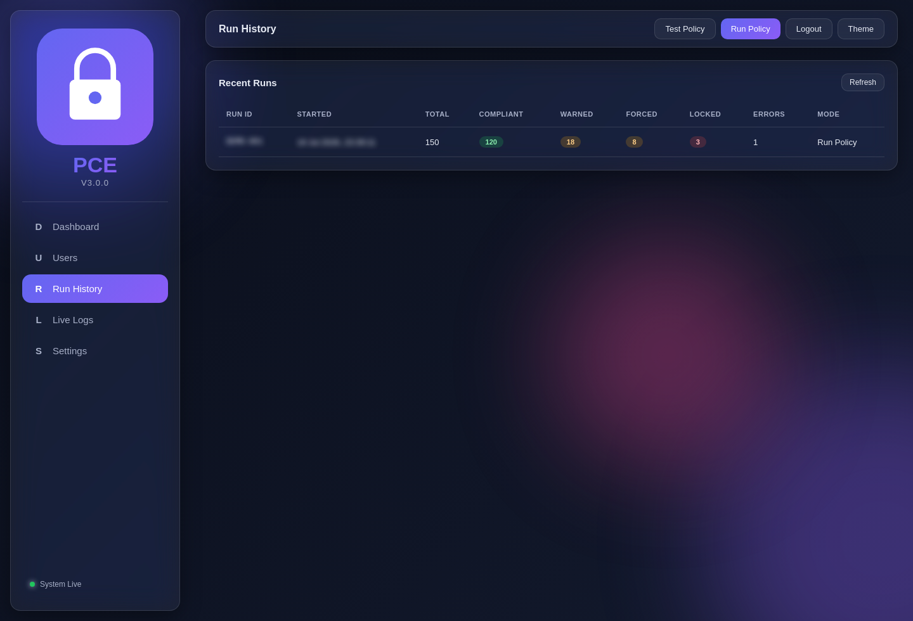
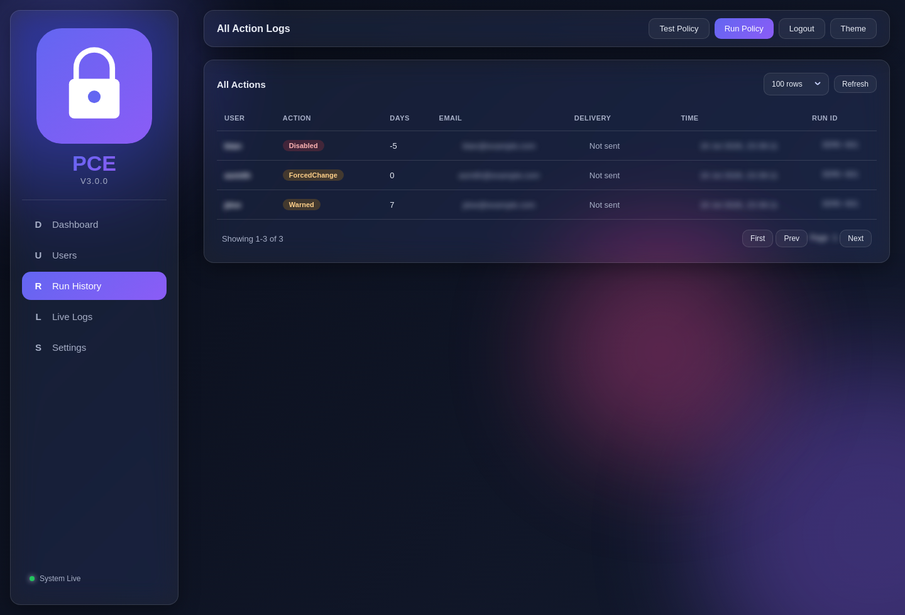
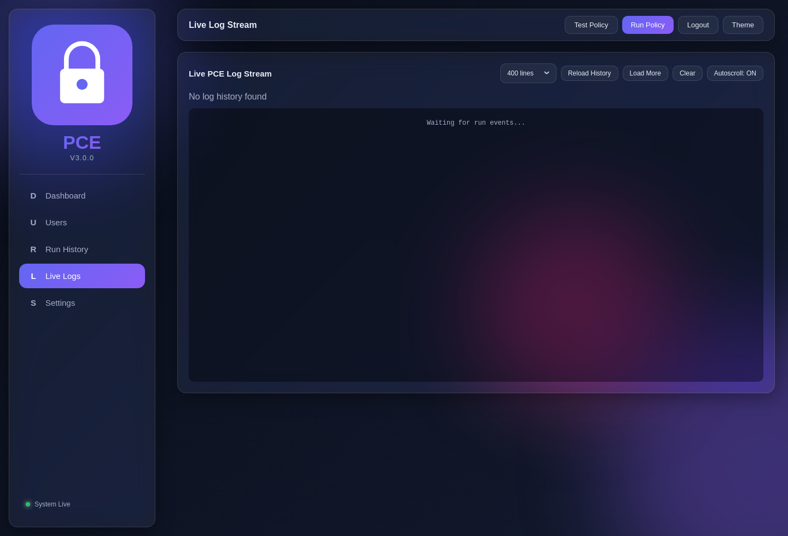

# Password Reminder AD

Enterprise password expiry reminder and compliance dashboard for Active Directory, Microsoft 365, and IT helpdesk operations.

Password Reminder AD, also known internally as Password Compliance Enforcer (PCE), helps IT teams monitor Active Directory password expiry, notify users before passwords expire, review policy runs, and execute controlled account actions from a secure web dashboard.

This repository is prepared for public or internal enterprise use. It contains source code, templates, and safe example configuration only. Runtime databases, production configuration, logs, secrets, certificates, and private keys are intentionally excluded.

## Preview

All screenshots below were captured from a demo environment. User identities, emails, UPNs, tenant values, server values, and other sensitive-looking data are blurred.

### Dashboard Overview



### User Data and Account Actions



### Settings, Secret Health, and Configuration Doctor



### Run History



### Action Audit Trail



### Live Logs



## Why This Project Exists

Password expiry is still a practical operational risk in many organizations that use Active Directory, hybrid identity, Microsoft 365, VPN, VDI, or remote access platforms. Users often miss expiry notifications, helpdesk teams lose time on repetitive unlock/reset requests, and enforcement can become risky when it is handled manually without visibility.

Password Reminder AD gives IT teams a single operational surface to:

- Identify users whose passwords are compliant, expiring soon, expired, locked, disabled, or missing password-date coverage.
- Send reminder emails through Microsoft Graph / Microsoft 365.
- Run safe monitoring before enabling reminder or enforcement workflows.
- Trigger manual helpdesk actions such as notify, unlock, enable, disable, force-change, and password reset.
- Review run history, delivery history, action history, and live backend logs.
- Keep secrets out of the repository and production config files.

## Core Features

### Dashboard and Monitoring

- KPI cards for compliant, expiring, expired, locked, total users, and last run.
- 30-day trend chart for warned, forced-change, and disabled outcomes.
- Expiry distribution chart for operational planning.
- Scheduler status with frequency, next run, timezone, cron expression, and reminder threshold note.
- Recent actions table for fast operational review.
- Responsive glass-style dashboard UI for desktop and mobile.

### Active Directory User Data

- Reads users from a configured Active Directory search base.
- Tracks SAM account name, UPN, display name, email, password last-set, password expiry, days left, locked state, disabled state, and must-change-at-logon state.
- Supports filtering by all, compliant, expiring, expired, locked, and disabled.
- Supports search across name, SAM, UPN, and email.
- Supports sortable user table columns.
- Handles missing or incomplete password date attributes.
- Can derive password last-set from expiry and maximum password age when safe.

### Helpdesk Account Actions

- Manual notify user.
- Manual password reset.
- Force password change at next logon.
- Unlock locked account.
- Enable disabled account.
- Disable account.
- Bulk notify, force-change, unlock, enable, and disable.
- Action queue and audit-friendly action history.
- Password reset flow designed for IT/helpdesk use and LDAPS-backed Active Directory operations.

### Reminder and Enforcement Policy

- `monitoring_only` mode for safe rollout and read-only validation.
- `reminder_only` mode for email reminders without account enforcement.
- `enforcement` mode for full policy execution.
- Configurable maximum password age.
- Configurable warning thresholds, for example 7, 3, and 1 days.
- Configurable grace period after expiry.
- Configurable action after grace period.
- Configurable force-change day.
- Duplicate reminder protection per password cycle and same-day delivery window.

### Microsoft 365 and Microsoft Graph

- Sends reminder emails using Microsoft Graph application authentication.
- Supports Microsoft 365 sender mailbox configuration.
- Supports Graph connectivity diagnostics.
- Supports optional cloud session revocation after selected actions when enabled.
- Keeps Graph client secrets in environment variables instead of committed config.

### Email Templates

- Built-in user warning template.
- Built-in expired/locked notification templates.
- Built-in admin report template.
- Template editor in Settings.
- Template preview with sample data.
- Test email workflow.
- Support for inline Global Secure Access guidance image.
- Placeholder-based rendering for display name, UPN, days left, deadline, and guide images.

### Teams Notification Templates

- Admin digest payload template.
- User warning payload template.
- User locked payload template.
- Safety alert payload template.
- Configurable Teams webhook URLs.
- Optional admin mentions.
- Retry, delay, timeout, and throttling settings.

### Settings and Diagnostics

- Runtime configuration view.
- API token browser-session setup.
- Secret Health table showing configured, missing, source, and config field status.
- Config Doctor for common deployment problems.
- AD bind diagnostic.
- LDAPS password-reset channel diagnostic.
- Entra / Microsoft Graph diagnostic.
- Sender mailbox diagnostic.
- Password date coverage diagnostic.
- Quick Config editor for policy, AD, mail, dashboard URL, scope, and admin recipients.

### Logging and Audit

- Run history page.
- Action audit page.
- Email delivery history.
- Live log stream powered by Server-Sent Events.
- Log history reload, load-more, clear, and autoscroll controls.
- Backend event ingestion endpoint.
- SQLite runtime storage for local operational history.

### Deployment and Operations

- Dockerfile for containerized deployment.
- Docker Compose service definition with healthcheck.
- Runtime volumes for `data`, `logs`, and `config`.
- `.env.example` for safe environment configuration.
- `config/config.example.json` for safe application configuration.
- Scheduler helper scripts for recurring reminder runs.
- One-time grace cutoff helper script.
- Windows helper scripts for LDAPS diagnose, prepare, repair, and password reset.
- Pytest smoke tests for dashboard/API behavior.
- GitLab Secret Detection pipeline template included.

## Architecture

```text
IT Admin / Helpdesk
        |
        v
FastAPI Web Dashboard
        |
        +-- SQLite Runtime Store
        |     - user snapshot
        |     - run history
        |     - action audit
        |     - email delivery history
        |     - live logs
        |
        +-- Active Directory / LDAP / LDAPS
        |     - user discovery
        |     - password expiry attributes
        |     - account lock / disabled state
        |     - password reset and account actions
        |
        +-- Microsoft Graph / Entra ID
              - Microsoft 365 email delivery
              - optional cloud session actions
```

## Technology Stack

- Python 3.12
- FastAPI
- Uvicorn
- Jinja2 templates
- SQLite with WAL mode
- LDAP3 for Active Directory integration
- Microsoft Graph via HTTP requests
- PowerShell helper modules and Windows scripts
- Docker and Docker Compose
- Pytest

## Project Layout

```text
.
├── config/
│   └── config.example.json
├── dashboard/
│   ├── api/
│   ├── static/
│   ├── templates/
│   ├── app.py
│   ├── db.py
│   ├── runner.py
│   ├── secrets.py
│   └── security.py
├── docs/
│   └── images/
│       └── screenshots/
├── modules/
├── scripts/
│   └── windows/
├── templates/
├── tests/
├── .dockerignore
├── .env.example
├── .gitignore
├── .gitlab-ci.yml
├── docker-compose.yml
├── Dockerfile
├── Install-PCE.ps1
├── Invoke-PCE.ps1
├── requirements.txt
├── requirements-dev.txt
└── VERSION
```

## Security Model

This repository should never contain live operational data or production secrets.

Excluded by default:

- `.env`
- `.env.*` except `.env.example`
- `config/config.json`
- `data/`
- `logs/`
- `backup/`
- SQLite database files
- Python cache files
- private keys
- certificates
- credential exports
- local archives and backups

Supported runtime secrets:

- `PCE_API_TOKEN`
- `PCE_AD_BIND_PASSWORD`
- `PCE_M365_CLIENT_SECRET`
- `PCE_NOTIFICATION_SMTP_PASSWORD`

Recommended security practices:

- Keep production values in `.env`, container environment variables, CI/CD secrets, or a secret manager.
- Keep `config/config.json` out of source control if it contains tenant, domain, host, OU, mailbox, or infrastructure-specific values.
- Use LDAPS for password reset and sensitive Active Directory write operations.
- Start in `monitoring_only` before enabling reminder or enforcement modes.
- Rotate any token or secret that was ever committed or shared in an unsafe channel.

## Quick Start

### 1. Create Local Runtime Files

```bash
cp .env.example .env
cp config/config.example.json config/config.json
```

### 2. Configure Environment Variables

Example development `.env`:

```env
PCE_API_TOKEN=replace-with-a-long-random-token
PCE_INVOKE_PATH=./Invoke-PCE.ps1
PCE_PS_EXE=pwsh
PCE_RUNNER_MODE=python
PCE_CONFIG_PATH=/app/config/config.json
PCE_ENV_PATH=/app/.env
PCE_HOST_PORT=18080
PCE_SEED_DEMO=false
PCE_TIMEZONE=Asia/Jakarta
PCE_SESSION_COOKIE_SECURE=false
PCE_EXPOSE_DEFAULT_API_TOKEN=false
PCE_AD_BIND_PASSWORD=
PCE_M365_CLIENT_SECRET=
PCE_NOTIFICATION_SMTP_PASSWORD=
```

### 3. Configure Application Settings

Edit `config/config.json` for non-secret settings:

- Active Directory server and search base.
- LDAP/LDAPS ports.
- Bind username.
- Microsoft 365 tenant ID and client ID.
- Reminder sender mailbox.
- Admin recipients.
- Dashboard base URL.
- Policy thresholds and run mode.

Keep bind passwords, Graph client secrets, SMTP passwords, and dashboard API tokens in environment variables.

### 4. Start With Docker Compose

```bash
docker compose up -d --build
```

Open:

```text
http://localhost:18080
```

Healthcheck:

```bash
curl http://localhost:18080/healthz
```

Expected response:

```json
{"status":"healthy","version":"3.0.0"}
```

## Run Modes

### `monitoring_only`

Read and display user status without sending automatic emails or changing accounts. Use this for initial deployment, validation, and safe audits.

### `reminder_only`

Send password expiry reminders based on policy thresholds without running automatic account enforcement.

### `enforcement`

Run reminders and configured enforcement actions. Use only after AD scope, email delivery, LDAPS readiness, and policy results are verified.

## Active Directory Requirements

Minimum read-only deployment:

- Directory bind access.
- Search permission for the configured OU/search base.
- Read access to password-related attributes.
- Read access to lockout, disabled, and account control attributes.

For account actions:

- LDAPS access to domain controller, normally port `636`.
- Valid domain controller certificate and trust chain.
- Delegated permissions for password reset, unlock, enable, disable, and force-change actions.

Included Windows scripts can help diagnose and prepare LDAPS:

- `scripts/windows/PCE-LDAPS-Diagnose.ps1`
- `scripts/windows/PCE-LDAPS-Prepare.ps1`
- `scripts/windows/PCE-LDAPS-Repair.ps1`
- `scripts/windows/PCE-PasswordReset.ps1`

## Microsoft 365 Requirements

For Graph-based email delivery, configure an Entra application registration with:

- Tenant ID.
- Client ID.
- Client secret or supported application authentication method.
- Application permissions appropriate for sending mail through Microsoft Graph.
- Admin consent according to your tenant policy.
- A valid sender mailbox.

Microsoft Graph is used for Microsoft 365 email delivery and optional cloud-side actions. On-prem Active Directory password reset is handled through AD/LDAPS, not Microsoft Graph.

## Testing

Install development dependencies:

```bash
python3 -m venv .venv
. .venv/bin/activate
pip install -r requirements-dev.txt
```

Run tests:

```bash
PYTHONPATH=. pytest -q
```

Run the dashboard locally with demo data:

```bash
PCE_SEED_DEMO=true \
PCE_API_TOKEN=dev-token \
PCE_CONFIG_PATH=config/config.example.json \
uvicorn dashboard.app:app --host 0.0.0.0 --port 8080
```

## Safe Rollout Plan

1. Start with `monitoring_only`.
2. Validate target OU and excluded users/groups.
3. Confirm user count and password expiry data quality.
4. Run Secret Health.
5. Run Config Doctor.
6. Validate Graph email delivery with a test mailbox.
7. Validate LDAPS readiness with a controlled test account.
8. Move to `reminder_only`.
9. Review reminder delivery history.
10. Move to `enforcement` only after results are trusted.

## Troubleshooting

### Users sync, but password reset fails

LDAP read may be working while LDAPS write operations are not ready. Check domain controller certificate, port `636`, service account permissions, and trust chain.

### Reminder email does not send

Check tenant ID, client ID, client secret, Graph permissions, admin consent, sender mailbox, and Config Doctor output.

### Password dates are missing

The AD query may not return `pwdLastSet` or expiry-related attributes for some accounts. The dashboard can flag missing coverage and, when safe, derive last-set from expiry and configured max password age.

### Secret Health reports missing secrets

Confirm whether secrets are provided through `.env`, container environment variables, or an external secret manager. The file does not need to exist inside the container if environment variables are injected directly.

### Live Logs look idle

Check scheduler execution, manual run triggers, API token validity, and whether the backend container restarted.

## Repository Keywords

Active Directory password expiry, password reminder, Microsoft 365 password notification, Entra ID, Microsoft Graph mail, LDAPS password reset, helpdesk dashboard, password compliance, account lockout, password enforcement, FastAPI dashboard, Docker Active Directory tool, IT operations automation.

## License

Add a license that matches your organization's distribution policy before publishing this project as open source.
