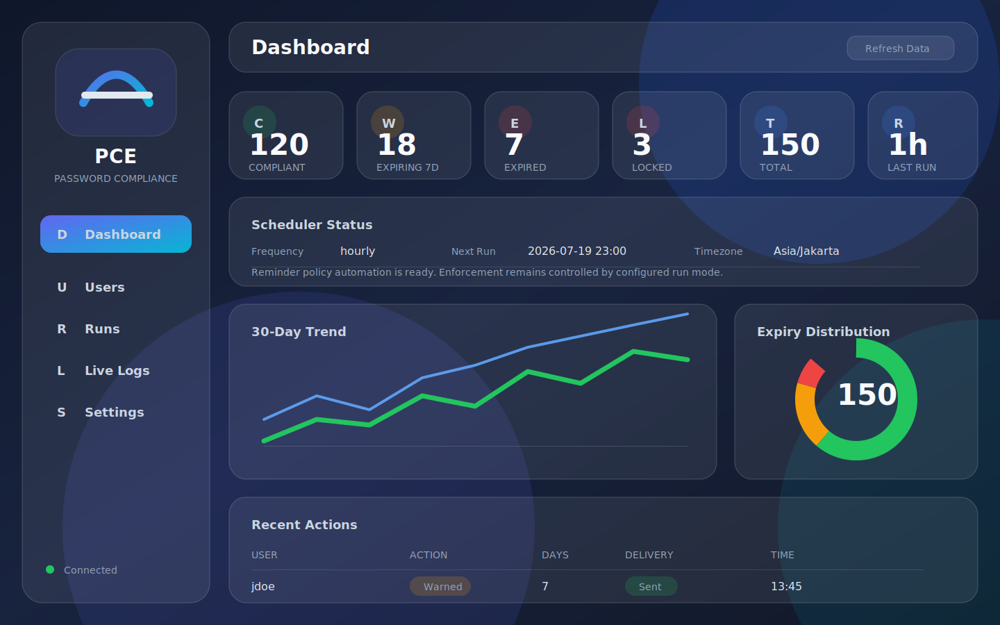

# Password Compliance Enforcer

Password Compliance Enforcer (PCE) adalah dashboard operasional untuk memantau masa berlaku password Active Directory, mengirim reminder melalui Microsoft 365, dan menjalankan tindakan enforcement yang aman ketika mode enforcement diaktifkan.

Repository ini disiapkan sebagai source repository publik/internal yang tidak membawa data runtime, database, log, secret, certificate, private key, atau konfigurasi produksi.



## Ringkasan

PCE memisahkan tiga lapisan utama:

- `Dashboard`: aplikasi FastAPI untuk UI, API, login token, live log, settings, run history, dan action queue.
- `Active Directory`: sinkronisasi user, pembacaan atribut password expiry, dan tindakan akun seperti reset password, unlock, enable, disable, serta force change at next logon.
- `Microsoft 365 / Graph`: pengiriman reminder email dari mailbox terkonfigurasi dan tindakan cloud-side opsional seperti revoke sessions.

SQLite digunakan hanya sebagai runtime store lokal untuk snapshot user, riwayat run, action log, live log, dan delivery history. File database tidak boleh di-commit.

## Fitur

- Dashboard KPI untuk compliant, expiring, expired, locked, total user, dan last run.
- Halaman Users dengan filter, search, status password, account state, dan action manual.
- Halaman Runs untuk riwayat policy execution.
- Halaman Actions untuk audit tindakan manual maupun otomatis.
- Halaman Logs dengan live log berbasis Server-Sent Events.
- Halaman Settings untuk konfigurasi, Secret Health, dan Config Doctor.
- Mode operasi `monitoring_only`, `reminder_only`, dan `enforcement`.
- Scheduler helper untuk reminder dan grace cutoff.
- Template email dan Teams notification payload.
- Script Windows untuk LDAPS diagnose, prepare, repair, dan password reset.
- Docker deployment dengan healthcheck.
- Smoke test dashboard berbasis `pytest`.

## Arsitektur

```text
Helpdesk / IT Admin
        |
        v
FastAPI Dashboard
        |
        +-- SQLite runtime DB
        |     - runs
        |     - users_snapshot
        |     - actions
        |     - email_deliveries
        |     - live_logs
        |
        +-- Active Directory / LDAP / LDAPS
        |     - user discovery
        |     - password expiry attributes
        |     - password reset and account actions
        |
        +-- Microsoft Graph / Entra ID
              - M365 email reminder delivery
              - optional cloud session revocation
```

## Project Layout

```text
.
├── config/
│   └── config.example.json
├── dashboard/
│   ├── api/
│   ├── static/
│   ├── templates/
│   ├── app.py
│   ├── db.py
│   ├── runner.py
│   ├── secrets.py
│   └── security.py
├── docs/
├── modules/
├── scripts/
│   └── windows/
├── templates/
├── tests/
├── .dockerignore
├── .env.example
├── .gitignore
├── docker-compose.yml
├── Dockerfile
├── Install-PCE.ps1
├── Invoke-PCE.ps1
├── requirements.txt
├── requirements-dev.txt
└── VERSION
```

Runtime-only paths yang sengaja tidak masuk repository:

- `.env`
- `config/config.json`
- `data/`
- `logs/`
- `backup/`
- `__pycache__/`
- certificate, private key, dan secret material

## Security Model

Repository hanya menyimpan template dan placeholder. Nilai produksi harus berada di environment variable, `.env` lokal, secret manager, atau mekanisme injection container.

Secret yang didukung:

- `PCE_API_TOKEN`
- `PCE_AD_BIND_PASSWORD`
- `PCE_M365_CLIENT_SECRET`
- `PCE_NOTIFICATION_SMTP_PASSWORD`

File dan data yang tidak boleh di-commit:

- `.env` dan `.env.*` selain `.env.example`
- `config/config.json` produksi
- database SQLite di `data/`
- log operasional di `logs/`
- backup, dump, export, private key, certificate, token, dan credential vault material

Jika secret pernah terlanjur masuk repository, jangan hanya menghapus file dari commit terbaru. Rotate secret tersebut dan bersihkan history repository sesuai kebijakan organisasi.

## Quick Start

### 1. Buat konfigurasi lokal

```bash
cp .env.example .env
cp config/config.example.json config/config.json
```

### 2. Isi `.env`

Gunakan placeholder untuk development, lalu ganti dengan secret sebenarnya hanya di environment lokal/production.

```env
PCE_API_TOKEN=replace-with-a-long-random-token
PCE_INVOKE_PATH=./Invoke-PCE.ps1
PCE_PS_EXE=pwsh
PCE_RUNNER_MODE=python
PCE_CONFIG_PATH=/app/config/config.json
PCE_ENV_PATH=/app/.env
PCE_HOST_PORT=18080
PCE_SEED_DEMO=false
PCE_TIMEZONE=Asia/Jakarta
PCE_SESSION_COOKIE_SECURE=false
PCE_EXPOSE_DEFAULT_API_TOKEN=false
PCE_AD_BIND_PASSWORD=
PCE_M365_CLIENT_SECRET=
PCE_NOTIFICATION_SMTP_PASSWORD=
```

### 3. Isi `config/config.json`

Isi hanya nilai non-secret seperti search base, target OU, sender metadata, run mode, dan policy threshold. Secret seperti bind password dan client secret tetap dikosongkan di config dan dipasok dari `.env`.

### 4. Jalankan dengan Docker

```bash
docker compose up -d --build
```

Dashboard default:

```text
http://localhost:18080
```

Healthcheck:

```bash
curl http://localhost:18080/healthz
```

Expected response:

```json
{"status":"healthy","version":"3.0.0"}
```

## Configuration Reference

### Policy

Mengatur umur password, threshold reminder, grace period, tindakan setelah grace period, dan run mode.

Nilai penting:

- `RunMode`: `monitoring_only`, `reminder_only`, atau `enforcement`
- `MaxPasswordAgeDays`
- `WarningDays`
- `GracePeriodDaysAfterExpiry`
- `ActionAfterGrace`
- `ForceChangeAtLogonOnDay`

### Scope

Mengatur cakupan akun yang diproses.

- `TargetOU`
- `ExcludedUsers`
- `ExcludedGroups`
- `WhitelistedUsers`
- `IncludeDisabledAccounts`

### ActiveDirectory

Digunakan untuk membaca user AD dan menjalankan action akun.

- LDAP read dapat memakai port `389` atau LDAPS `636`.
- Password reset dan write operation sebaiknya memakai LDAPS `636`.
- `BindPassword` harus dipasok dari `PCE_AD_BIND_PASSWORD`, bukan disimpan di config produksi.

### M365

Digunakan untuk Microsoft Graph mail delivery.

- `TenantId`
- `ClientId`
- `GraphBaseUrl`
- `ReminderSender`
- `ClientSecret` harus dipasok dari `PCE_M365_CLIENT_SECRET`.

### Notification

Metadata sender dan admin recipient untuk reminder/report.

- `FromAddress`
- `FromDisplayName`
- `AdminRecipients`
- `Password` harus dipasok dari `PCE_NOTIFICATION_SMTP_PASSWORD` jika flow SMTP masih digunakan.

### Dashboard

Konfigurasi UI/API.

- `BaseUrl`
- `ApiToken` harus dipasok dari `PCE_API_TOKEN`.

## Run Modes

### `monitoring_only`

Mode paling aman untuk rollout awal. Aplikasi melakukan sync dan menampilkan status tanpa reminder otomatis dan tanpa enforcement.

### `reminder_only`

Aplikasi melakukan sync dan mengirim reminder, tetapi tidak menjalankan tindakan enforcement seperti disable atau force-change otomatis.

### `enforcement`

Aplikasi menjalankan policy penuh berdasarkan threshold yang dikonfigurasi. Gunakan hanya setelah hasil monitoring dan reminder tervalidasi.

## Dashboard Pages

- `Dashboard`: KPI, trend, expiry distribution, scheduler status, dan recent actions.
- `Users`: daftar user, filter status, password expiry, lock/disabled state, dan action manual.
- `Runs`: riwayat eksekusi policy.
- `Actions`: audit tindakan per user.
- `Logs`: live logs dari backend.
- `Settings`: editor konfigurasi, Secret Health, dan Config Doctor.

## Operations

### Safe Rollout

1. Jalankan `monitoring_only`.
2. Validasi search base, jumlah user, dan atribut password expiry.
3. Validasi Secret Health.
4. Validasi Graph email delivery.
5. Validasi LDAPS readiness untuk password reset/action.
6. Pindah ke `reminder_only`.
7. Pindah ke `enforcement` setelah hasil policy dipercaya.

### Manual Actions

Action manual tersedia dari dashboard dan diproses ke AD:

- notify user
- reset password
- unlock account
- enable account
- disable account
- force change at next logon

Password reset dan write operation membutuhkan LDAPS yang sehat.

## Testing

Install dependency di virtual environment:

```bash
python3 -m venv .venv
. .venv/bin/activate
pip install -r requirements-dev.txt
```

Jalankan test:

```bash
pytest -q
```

Jalankan app lokal tanpa Docker:

```bash
PCE_SEED_DEMO=true PCE_API_TOKEN=dev-token uvicorn dashboard.app:app --host 0.0.0.0 --port 8080
```

## Troubleshooting

### Password reset gagal tetapi user sync berhasil

Kemungkinan LDAP read berhasil, tetapi LDAPS write path belum siap. Periksa certificate domain controller, trust chain, firewall ke port `636`, dan delegated permission service account.

### Reminder email gagal

Periksa `TenantId`, `ClientId`, `PCE_M365_CLIENT_SECRET`, sender mailbox, permission Microsoft Graph, dan admin consent.

### Secret Health menunjukkan secret missing

Pastikan `.env` dimount oleh Docker Compose atau environment variable diinjeksi langsung ke container. Secret tidak perlu muncul di file jika sudah tersedia sebagai process environment.

### Live Logs idle

Periksa apakah scheduler sudah berjalan, action manual sudah dipicu, token dashboard valid, dan container tidak restart berulang.

## Repository Publication Checklist

Sebelum push ke GitHub/GitLab:

- Pastikan `git status --ignored` tidak menunjukkan secret yang akan masuk index.
- Jangan commit `.env`, `config/config.json`, `data/`, `logs/`, atau `backup/`.
- Jangan commit private key, certificate, token export, database dump, atau file hasil troubleshooting production.
- Gunakan `config/config.example.json` dan `.env.example` sebagai dokumentasi konfigurasi.
- Rotate secret jika pernah masuk commit history.

## License

Tambahkan license sesuai kebijakan organisasi sebelum repository dijadikan publik.
